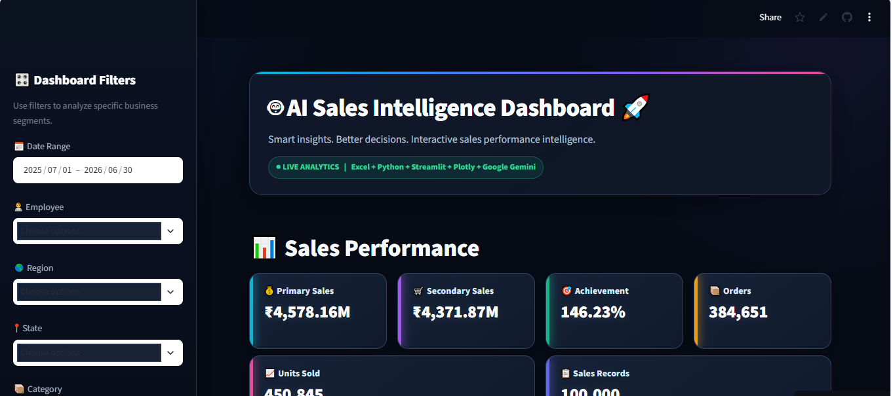

# 🤖 AI Sales Intelligence Dashboard

An interactive **AI-powered Sales Intelligence Dashboard** built with Python, Streamlit, Pandas, Plotly and Google Gemini.

The dashboard transforms sales data into actionable business insights through interactive analytics, performance tracking and AI-powered analysis.

## 🚀 Live Demo

👉 **[Open AI Sales Intelligence Dashboard](https://ai-sales-intelligence.streamlit.app/)**

You can open the live dashboard directly in your browser without installing anything.


## 📊 Dashboard Overview

The AI Sales Intelligence Dashboard provides an interactive view of sales performance and allows users to analyze business data using multiple filters.

Users can dynamically filter the dashboard by:

- 📅 Date Range
- 👤 Employee
- 🌍 Region
- 📍 State
- 📦 Category
- 🏷️ Other available business dimensions

All dashboard visualizations and KPIs update according to the selected filters.

---

## ✨ Key Features

### 📈 Sales Performance Analytics

The dashboard provides important sales KPIs including:

- Primary Sales
- Secondary Sales
- Achievement
- Orders
- Customer Performance
- Year-over-Year comparisons
- Target performance
- Sales trends and performance analysis

### 🔎 Interactive Filtering

Users can select different business segments and instantly analyze the corresponding sales performance.

### 🤖 AI-Powered Business Intelligence

The dashboard integrates **Google Gemini API** to provide AI-powered analysis of the filtered sales data.

Users can:

- 📊 Generate Executive Summaries
- ⚠️ Identify Business Risks
- 🚀 Find Growth Opportunities
- 🎯 Analyze Target Performance
- 💬 Ask custom business questions

The AI analyzes the currently filtered dataset and generates business-focused insights.

### 📊 Interactive Visualizations

Charts and visualizations are built using **Plotly**, allowing users to interact with sales data and explore trends.

---

## 🧠 AI Intelligence

The AI analysis section allows users to ask questions such as:

> "What are the biggest risks in the current sales performance?"

> "Which regions are performing below expectations?"

> "Where are the biggest growth opportunities?"

> "Explain the current sales performance."

The AI uses the filtered business data to generate contextual insights.

---

## 🛠️ Technology Stack

| Technology | Purpose |
|---|---|
| 🐍 Python | Core programming language |
| 🎨 Streamlit | Interactive dashboard and web application |
| 🐼 Pandas | Data processing and analysis |
| 📊 Plotly | Interactive charts and visualizations |
| 🤖 Google Gemini | AI-powered business intelligence |
| 📗 Excel | Sales dataset |
| 🔧 Git & GitHub | Version control and project hosting |
| ☁️ Streamlit Cloud | Application deployment |

---

## 📂 Project Structure

```text
AI-Sales-Intelligence/
│
├── app.py
│
├── requirements.txt
│
├── Data/
│   └── AI_Sales_Intelligence_Dataset.xlsx
│
└── README.md
